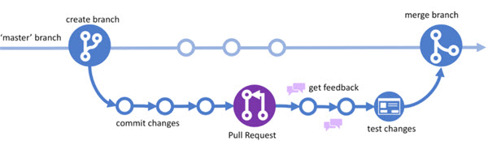
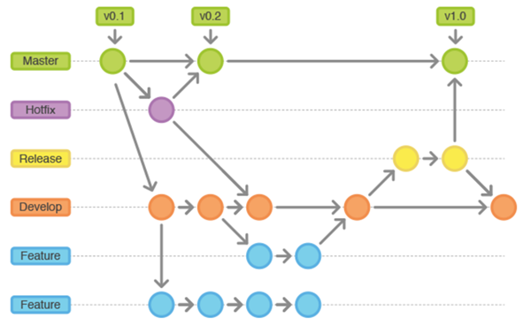

# Branching Types

## Demos

**GitHub Flow** — Implement a simple, continuous deployment workflow with a main branch and feature branches. Each feature goes through pull request review and merges directly to main, enabling rapid iteration and frequent releases. Ideal for teams practicing continuous delivery.

**Git Flow** — Manage complex release cycles with dedicated branches for features, releases, and hotfixes. This strategy separates development (`develop` branch) from production (`main` branch), allowing planned releases and parallel work on multiple features and bug fixes simultaneously. Best for projects with scheduled releases and multiple versions in production.

## GitHub Flow



>Note: This is the recommended branching strategy for GitHub repositories, and is widely used in open source projects and teams practicing continuous delivery.

**Overview** — GitHub Flow is a lightweight branching model designed for continuous deployment. Create feature branches from main, commit changes, open a pull request for review, and merge back to main when approved. Every merge to main should be deployable.

**Key characteristics:**

- Single main branch always in a deployable state
- Short-lived feature branches for new work
- Pull requests for code review and discussion
- Automatic deployment after merge

## Git Flow



**Overview** — Git Flow provides a structured approach for managing multiple release branches and hotfixes in parallel. It uses `main` for production releases, `develop` for integration, feature branches for new work, release branches for preparing releases, and hotfix branches for production fixes.

> **Requirements:** Git 2.24.0+ — Check your version with `git --version`. On Linux, install with `sudo apt-get install -y git-flow`

**Initialize repository for Git Flow:**

```bash
git flow init
```

**Feature Development:**

Start a new feature branch:

```bash
git flow feature start <FEATURE>
```

Publish feature to remote for collaboration:

```bash
git flow feature publish <FEATURE>
```

Finish feature and merge to develop:

```bash
git flow feature finish <FEATURE>
```

**Release Management:**

Start a release branch for version preparation:

```bash
git flow release start <RELEASE>
```

Finish release and merge to main and develop:

```bash
git flow release finish <RELEASE>
```

## Links & Resources

[GitFlow Cheatsheet](https://danielkummer.github.io/git-flow-cheatsheet/)

[GitHub Flow Documentation](https://docs.github.com/en/get-started/quickstart/github-flow)

[Handling Merge Conflicts in VS Code](https://code.visualstudio.com/docs/editor/versioncontrol#_merge-conflicts)
