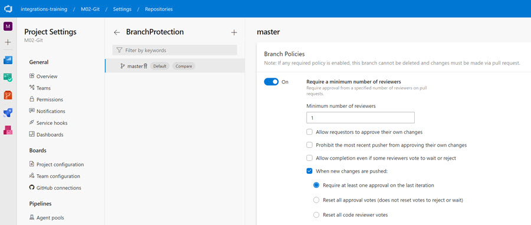
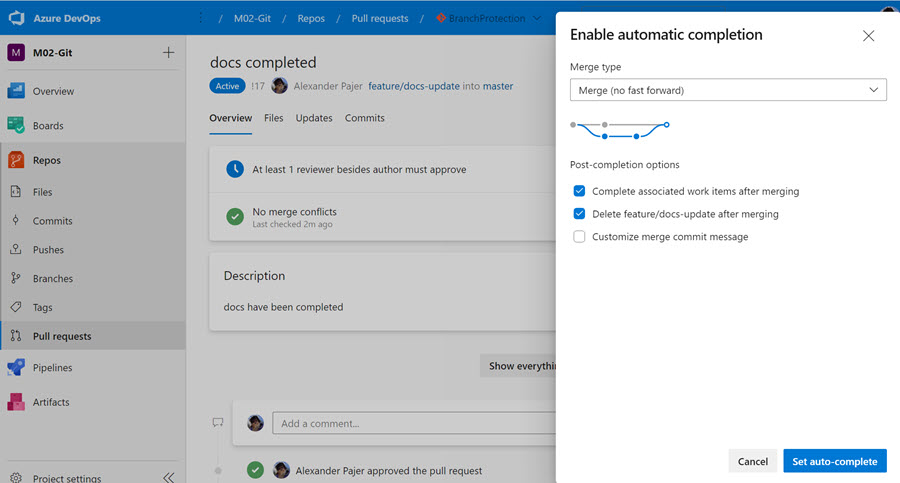

# Branch Protection Policy

Demonstrates enforcing code quality and team workflows through branch policies. This demo shows how to configure protection rules on repository branches to prevent direct commits, require pull request approvals, and maintain code standards before merging to main branches.

## Demo Walkthrough

**Configure Branch Policies**

Navigate to your repository settings and access the branch policies configuration:

1. Go to **Repositories**
2. Select your repository → **Policies**
3. Select the target branch (typically `main` or `develop`)
4. Review and configure branch policy rules

The policy screen shows all available protection rules including minimum reviewer requirements, build validation, and work item linking.

**Enforce Workflow with Protection**

Once policies are enabled, direct commits are blocked:

1. Attempt to make changes directly to the protected branch (will be rejected)
2. Create a feature branch for your changes
3. Commit your code to the feature branch
4. Submit a pull request to merge into the protected branch
5. Request reviewers and wait for approval

The pull request interface shows required approvals, policy checks, and merge restrictions based on your configured policies.

## Links & Resources

[Azure DevOps - Branch policies](https://docs.microsoft.com/en-us/azure/devops/repos/git/branch-policies-overview)

[Improve code quality with branch policies](https://docs.microsoft.com/en-us/azure/devops/repos/git/branch-policies?view=azure-devops)

[GitHub Branch Protection Rules](https://docs.github.com/en/repositories/configuring-branches-and-merges-in-your-repository/managing-protected-branches/managing-a-branch-protection-rule)

[New Pull Request Experience for Azure Repos](https://devblogs.microsoft.com/devops/introducing-the-new-pull-request-experience-for-azure-repos/)
