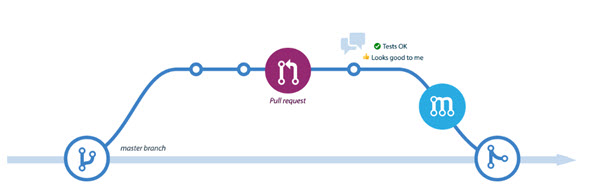
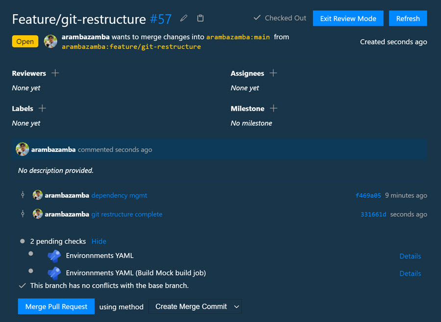

# Pull Requests

Demonstrates the pull request workflow for code review and collaboration. This demo covers creating pull requests from feature branches, requesting reviewers, and managing the merge process in both Azure DevOps and GitHub using integrated tooling in VS Code.

## Demo

**Create and Manage Pull Requests**

Pull requests provide a structured way to review code changes before merging into main branches:

1. Create a feature branch for your changes
2. Commit and push your code
3. Navigate to your repository and create a new pull request
4. Add a description and select reviewers
5. Address feedback and iterate until approved

The pull request UI shows the change diff, reviewer assignments, and approval status all in one view.

**VS Code Integration**

The [GitHub Pull Requests and Issues](https://marketplace.visualstudio.com/items?itemName=GitHub.vscode-pull-request-github) extension brings pull request workflows directly into your editor:

- Create, review, and merge PRs without leaving VS Code
- View inline code comments and discussions
- Check PR status and CI/CD pipeline results

This integration streamlines the review process by allowing developers to manage pull requests within their development environment.

## Links & Resources

[Create pull requests](https://docs.microsoft.com/en-us/azure/devops/repos/git/pull-requests)

[GitHub Pull Requests and Issues Extension](https://marketplace.visualstudio.com/items?itemName=GitHub.vscode-pull-request-github)
