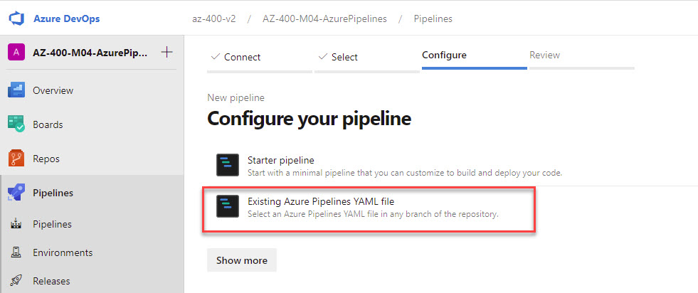
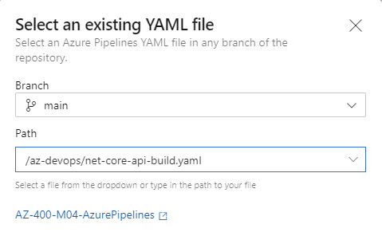

# YAML Pipelines

Demonstrates building and publishing a .NET Core application using Azure Pipelines YAML syntax. YAML pipelines provide a code-first approach to defining CI workflows, with full version control and integration with the repository.

## Demos

**YAML Pipeline Configuration** - The [02-02-catalog-ci.yml](/.azdo/catalog-ci.yml) pipeline implements a multi-step build process that installs the .NET 10 SDK, compiles the project, publishes artifacts, and conditionally publishes the build output. Key features include stage-based organization, task reuse with DotNetCoreCLI, and conditional artifact publishing based on the source branch.

The pipeline structure demonstrates best practices for YAML pipelines:

- Triggered on `master` branch commits
- Uses Azure Pipelines hosted agents (`ubuntu-latest`)
- Defines build configuration variables for flexibility
- Publishes artifacts for downstream release pipelines

**Pipeline Import** - Import the pipeline into your Azure DevOps project:

_Step 1: Add a new pipeline from the Pipelines menu_

_Step 2: Select the YAML file from your repository_
