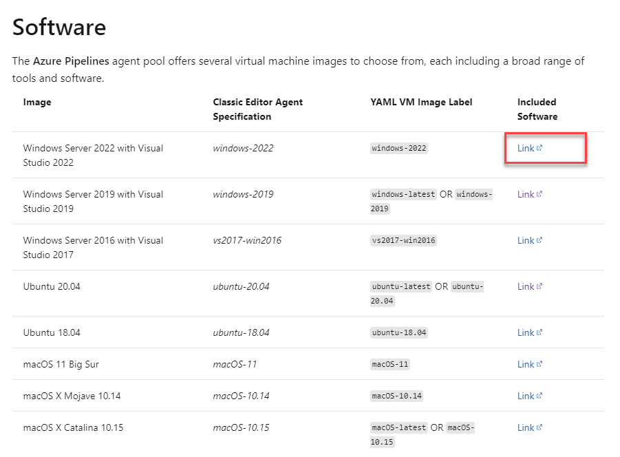

# Implement & Use a Self-hosted Docker Agent

Self-hosted Docker agents provide a lightweight, containerized alternative to traditional agent VMs. This demo shows how to build a custom Docker image with pre-installed tooling, deploy it to Azure Container Instances (ACI), and connect it to Azure DevOps for pipeline execution.

_Reference: Microsoft Hosted Agents Software Inventory provides the baseline for tools available on Azure-hosted agents_

## Demos

### Create & Deploy Self-hosted Docker Linux Agent

Demonstrates building a containerized DevOps agent image from Ubuntu with the Azure Pipelines agent runtime. The approach uses a multi-layer Dockerfile that installs base dependencies, downloads the DevOps agent package, and adds custom tooling via installer scripts. Key features:

- **Customizable tooling**: Add custom installers in `/installers/` directory to extend agent capabilities beyond the base image
- **Version control**: Dockerfile uses `AGENT_VERSION` parameter to pin specific DevOps agent versions from the [azure-pipelines-agent](https://github.com/Microsoft/azure-pipelines-agent/releases) repository
- **Docker Hub distribution**: Pre-built image published at [DockerHub](https://hub.docker.com/repository/docker/alexander-kastil/aciagentlinux) for quick reuse

**Implementation files**:

- [linux-agent/](./linux-agent/) - Dockerfile and installer scripts for image customization
- [create-linux-agent.azcli](./create-linux-agent.azcli) - Azure CLI script to provision ACI instance with the agent image

The CLI script provisions the container with AZP environment variables (org URL, PAT token, agent pool name) required for DevOps authentication.

### Test Your Agents with Various Workloads

Validate agent functionality by running different build and test scenarios through the deployed agent pool. Use the agent in pipelines to confirm capabilities match your workload requirements.

## Links & Resources

[Run a self-hosted agent in Docker](https://learn.microsoft.com/en-us/azure/devops/pipelines/agents/docker?view=azure-devops)

[Authenticate with Azure Container Registry from Azure Container Instances](https://learn.microsoft.com/en-us/azure/container-registry/container-registry-auth-aci)
