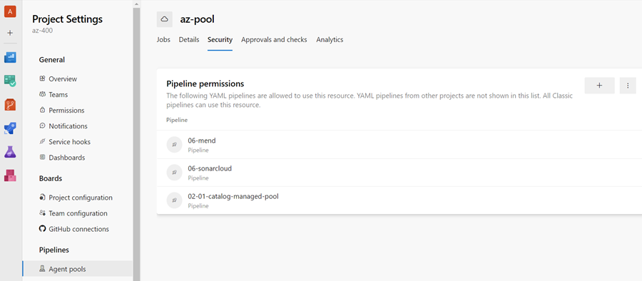

# Azure Managed DevOps Pools

Azure Managed DevOps Pools provide a zero-operations agent management solution where Azure handles provisioning, scaling, and maintenance automatically. This demo shows how to create a managed agent pool in Azure and configure pipelines to execute against it without manual agent administration.


_Azure DevOps portal showing managed pool agent pool configuration_

## Demos

### Create and Configure an Azure Managed DevOps Pool

Demonstrates the setup process for Azure-managed agents without operational overhead. The approach involves two key steps:

1. **Infrastructure setup**: Create an [Azure Dev Center](https://learn.microsoft.com/en-us/azure/deployment-environments/how-to-create-configure-dev-center) and register the `Microsoft.DevOpsInfrastructure` provider at subscription level. This establishes the Azure foundation for managed agent provisioning.

2. **Pipeline integration**: Once created, the pool appears in Azure DevOps portal under `Project Settings` → `Agent Pools` and can be referenced by name in pipeline definitions. Key feature: pipelines automatically scale agents up/down based on demand without configuration.

**Example pipeline usage** - reference the managed pool by name:

```yaml
trigger: none
pr: none

variables:
  buildConfiguration: Release
  appPath: src/services/catalog-service/api/

pool: az-pool

stages:
  - stage: "Build"
    jobs:
      - job: BuildJob
        steps:
          - script: echo Building...
```

The managed pool eliminates the need for agent maintenance, patching, or capacity planning—Azure DevOps handles all operational aspects automatically.

## Links & Resources

[Managed DevOps Pools](https://learn.microsoft.com/en-us/azure/devops/managed-devops-pools/overview?view=azure-devops)

[Quickstart: Create a Managed DevOps Pool using the Azure portal](https://learn.microsoft.com/en-us/azure/devops/managed-devops-pools/quickstart-azure-portal?view=azure-devops)
