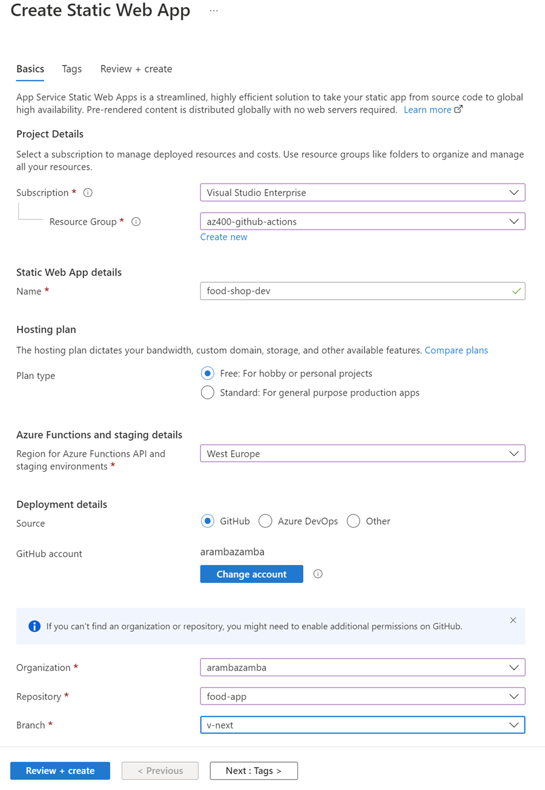
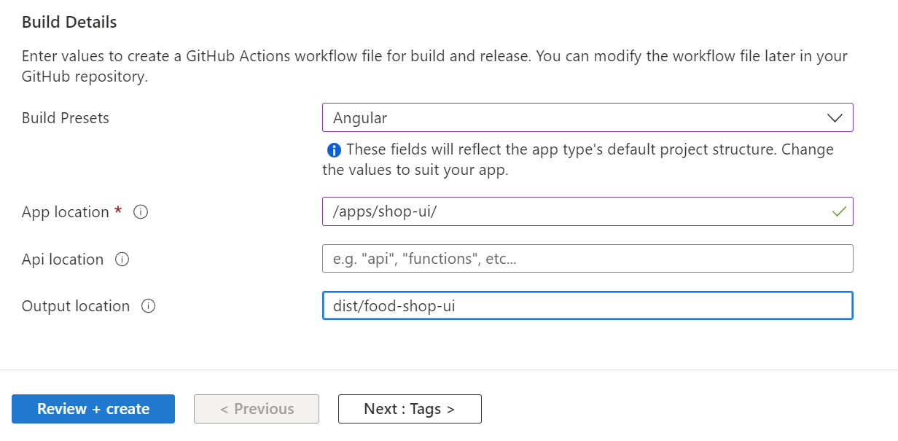

# Azure Static Web App / Angular Continuous Integration

Demonstrates deploying an Angular application to Azure Static Web Apps with automated CI/CD using GitHub Actions. Static Web Apps provide built-in GitHub Actions workflows and automatic deployment preview environments for pull requests.

## Demo Overview

### Option 1: Azure Portal

**Create Static Web App**



**Configure Angular Build Details**



- App location: `apps/shop-ui/`
- Output location: `dist/food-shop-ui`

### Option 2: Automated Provisioning

Automate Static Web App creation using [create-static-webapp.azcli](create-static-webapp.azcli). This approach:

Creates a resource group and Static Web App instance in Azure

Automatically retrieves the deployment API token from Azure

Stores the token as a GitHub secret (`AZURE_STATIC_WEB_APPS_API_TOKEN`) for automated deployments

```bash
env=dev
grp=az400-$env
loc=westeurope
app=foodui-$env
repo="alexander-kastil/az-400"

az group create -n $grp -l $loc

az staticwebapp create -n $app -g $grp -l $loc

gh secret set AZURE_STATIC_WEB_APPS_API_TOKEN --body "$(az staticwebapp secrets list -n $app -g $grp --query 'properties.apiKey' -o tsv)" --repo "$repo"
```

### Pipeline Authentication

For GitHub Actions pipelines, use token-based authentication:

```bash
az staticwebapp create -n $app -g $grp -s $repo -l $loc -b master --app-location "apps/shop-ui/" --output-location "dist/food-shop-ui" --token $gittoken
```

**Prerequisites**: Set GitHub access token in your environment:

```bash
gittoken=YOUR-TOKEN
```

Refer to [Creating a personal access token](https://docs.github.com/en/authentication/keeping-your-account-and-data-secure/creating-a-personal-access-token) for details.

## Links & Resources

[Azure Static Web Apps](https://learn.microsoft.com/en-us/azure/static-web-apps/)

[az staticwebapp](https://learn.microsoft.com/en-us/cli/azure/staticwebapp?view=azure-cli-latest)
