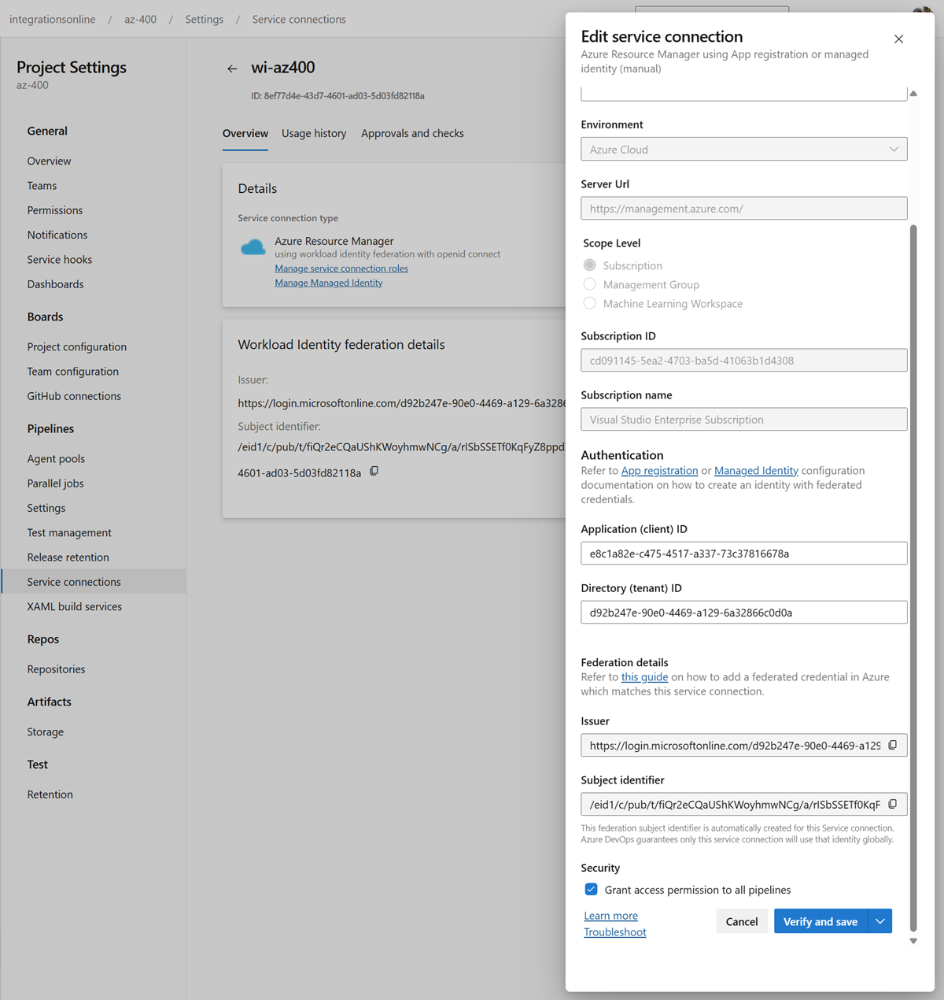

# Azure Devops Service Connections

## Links & Resources

[Workload Identity Federation](https://learn.microsoft.com/en-us/entra/workload-id/workload-identity-federation)

[Connect to Azure by using an Azure Resource Manager service connection](https://learn.microsoft.com/en-us/azure/devops/pipelines/library/connect-to-azure?view=azure-devops)

[Azure DevOps CLI service endpoint](https://learn.microsoft.com/en-us/azure/devops/cli/service-endpoint?view=azure-devops)

## Create a Workload Identity Service Connection

Use the provided scripts to automate the creation of a managed identity and Azure DevOps service connection with workload identity federation.

### PowerShell Version

```powershell
./create-workload-identity.ps1
```

- Resource group: `az400-dev`
- Managed identity: `wi-az400`

### Bash Version

```bash
bash create-workload-identity.sh
```

- Resource group: `az400-bash`
- Managed identity: `wi-az400-bash`

### What the scripts do

- Create a resource group and managed identity
- Create an Azure DevOps service connection with workload identity federation
- Automatically sync the federated credential with Azure DevOps generated issuer/subject
- Assign Contributor role to the resource group
- Share the service connection with all pipelines

You can check the created service connection in your Azure DevOps project settings under "Service connections":



## Delete a Workload Identity Service Connection

Use the delete scripts to clean up resources in the correct order (federated credential → service connection → role assignments → managed identity).

### PowerShell Version

```powershell
./delete-workload-identity.ps1
```

### Bash Version

```bash
bash delete-workload-identity.sh
```

## Use Workload identity in Azure DevOps

- Examine pipeline `catalog-ci-cd-workload-identity.yml`. It uses `scWorkload`

```yaml
variables:
  dotnetSdkVersion: "9.x"
  buildConfiguration: Release
  releaseBranchName: master
  serviceConnection: scWorkload
  appPath: src/services/catalog-service/api/
  appService: food-catalog-api-yaml
```
