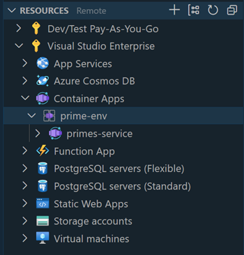
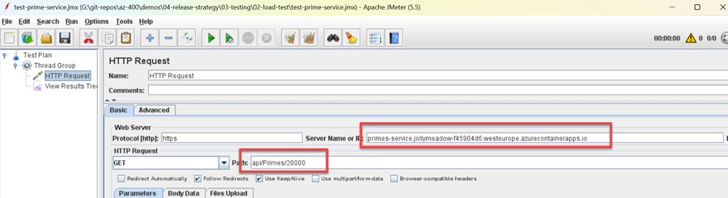
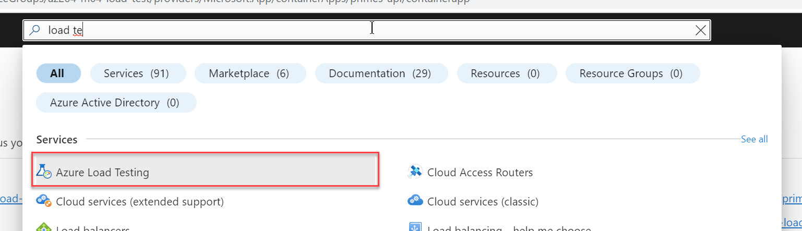
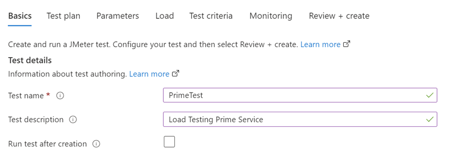
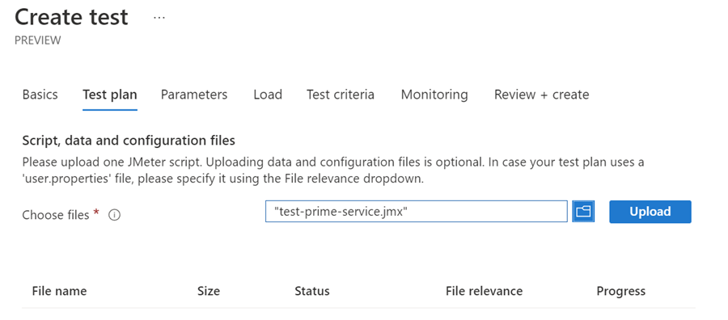
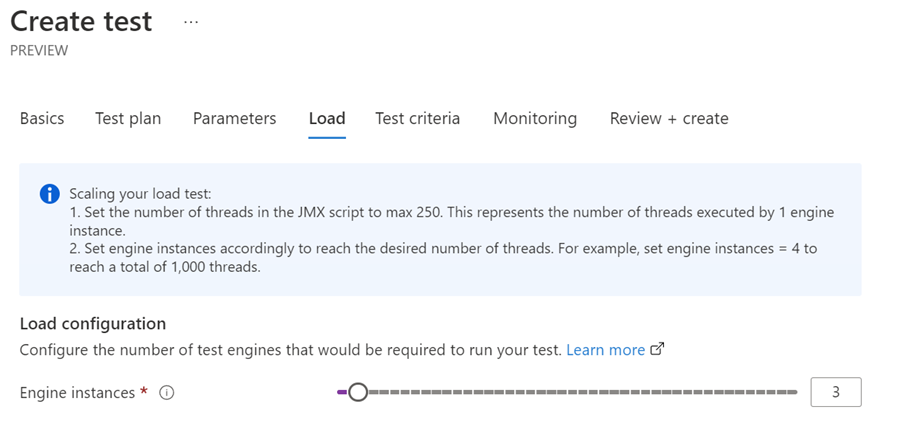
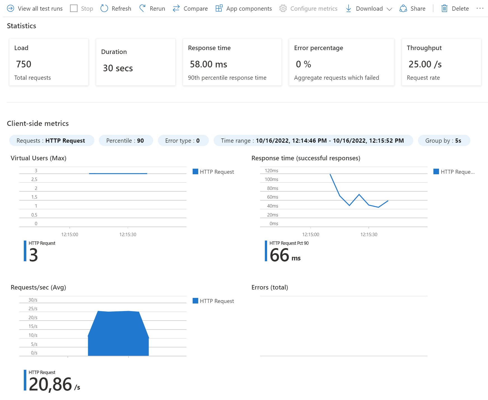

# Load Testing with Azure Load Testing

## Overview

This demo showcases Azure Load Testing for the **Prime Service** - a .NET API that calculates prime numbers and returns performance metrics. The service is containerized and deployed to Azure Container Apps.

## Prime Service API

The PrimesService calculates the count of prime numbers up to a given number and returns the time taken:

```c#
[HttpGet]
[Route("{n}")]
public IActionResult Get(int n)
{
    Stopwatch watch = new Stopwatch();
    watch.Start();
    var count = getPrimesCount(n);
    watch.Stop();
    return Ok($"Primes - {count}, Time Taken - {watch.ElapsedMilliseconds}ms, Instance Id - {Environment.GetEnvironmentVariable("WEBSITE_INSTANCE_ID")}");
}
```

## Automated Pipeline Approach (Recommended)

For automated, repeatable load testing without local dependencies, use the Azure DevOps pipeline:

### Quick Start

1. **Run the Pipeline**
   ```bash
   # Navigate to Azure DevOps Pipelines
   # Select: .azdo/azure-load-test.yml
   # Click: "Run pipeline"
   ```

2. **What the Pipeline Does**
   - Builds container image in Azure Container Registry
   - Deploys to Azure Container Apps
   - Runs smoke tests
   - Executes load tests (when configured)
   - Optional: Cleans up resources

3. **Benefits**
   - ✅ No local setup required
   - ✅ Consistent test environment
   - ✅ Full automation
   - ✅ Integrated with CI/CD
   - ✅ Audit trail in pipeline history

### Pipeline Configuration

The pipeline (`azure-load-test.yml`) includes:
- **Build Stage**: Builds image in ACR using `az acr build`
- **Deploy Stage**: Deploys to Azure Container Apps
- **Load Test Stage**: Executes load tests
- **Cleanup Stage**: Optional resource cleanup

See [load-test.md](./load-test.md) for detailed implementation plan.

## Manual Testing Approach (Original)

## Manual Testing Approach (Original)

For manual testing or local development:

### Prerequisites

- Install [Apache JMeter](https://jmeter.apache.org/) and requirements:

  ```powershell
  choco install jdk8 -y
  choco install jmeter -y
  ```

### Deploy the Service

### Deploy the Service

Deploy `PrimesService` to [Azure Container Apps](https://learn.microsoft.com/en-us/azure/container-apps/) using:

**Option 1: Visual Studio Code**
- Use the [Container Apps Extension](https://marketplace.visualstudio.com/items?itemName=ms-azuretools.vscode-azurecontainerapps)

  

**Option 2: Azure CLI Script**
- Execute `create-prime-service.azcli`

### Test the Deployed Service

### Test the Deployed Service

```bash
curl https://primes-api.kindplant-307af914.westeurope.azurecontainerapps.io/api/primes/10000
```

> Note: The url is taken from the container app overview. Add `/api/primes/10000` to the url.

### Configure JMeter Load Test

#### Using Original Test Plan

- Create a new JMeter test plan by importing `test-prime-service.jmx` into the JMeter GUI

  

- Update the URL in the JMeter test plan according to your URL and save:

  ```bash
  primes-api.kindplant-307af914.westeurope.azurecontainerapps.io
  ```

#### Using Parameterized Test Plan (Recommended)

- Use `test-prime-service-parameterized.jmx` which supports dynamic configuration
- Pass parameters via command line or Azure Load Testing:

  ```bash
  jmeter -n -t test-prime-service-parameterized.jmx \
    -Jwebapp=your-app.azurecontainerapps.io \
    -Jthreads=250 \
    -Jrampup=30 \
    -Jduration=60
  ```

### Run Load Test in Azure Portal

### Run Load Test in Azure Portal

1. **Create Load Testing Instance**
   - Search for "Azure Load Testing" in the Azure Portal
   - Click "Create" and accept defaults

  

2. **Create and Configure Test**
   - Choose "Upload JMeter script"
   - Upload your JMX file
   - Configure test parameters

  
  
  

3. **Execute and Review**
   - Run the test
   - Examine results and performance metrics

  

## Test Files

- `test-prime-service.jmx` - Original JMeter test plan with hardcoded URL
- `test-prime-service-parameterized.jmx` - Parameterized test plan for dynamic configuration
- `create-prime-service.azcli` - Azure CLI script for manual deployment
- `load-test.md` - Detailed implementation plan and documentation

## Resources

- [Azure Load Testing Documentation](https://learn.microsoft.com/en-us/azure/load-testing/)
- [Azure Container Apps Documentation](https://learn.microsoft.com/en-us/azure/container-apps/)
- [JMeter Documentation](https://jmeter.apache.org/usermanual/index.html)
- [Prime Service Source Code](../../../src/services/prime-service/)
