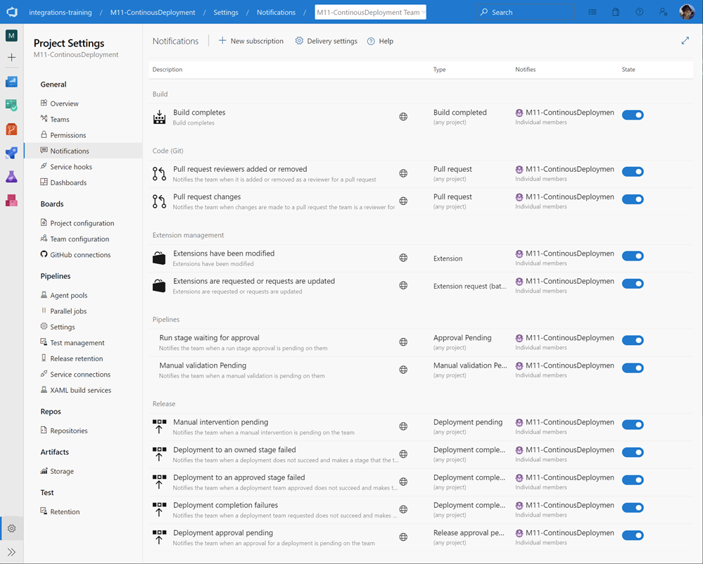

# Health Inspection and Release Monitoring

This module demonstrates how to monitor deployment health, track release status, and maintain visibility into application performance after deployments. Key topics include Azure DevOps notifications, audit logging, and release dashboards.

## Overview

Effective deployment health monitoring ensures you can quickly identify and respond to issues post-deployment. This includes:

- **Notifications**: Real-time alerts on pipeline events, approvals, and deployment status changes
- **Audit Trails**: Complete visibility into organizational changes and compliance requirements
- **Dashboards**: Visual tracking of release progress, test results, and application metrics

## Configuration

Configure notifications in Azure DevOps to receive real-time updates on deployment events:

Set up subscriptions for:

- Pipeline completion events
- Release deployment approvals
- Work item changes
- Team mentions and mentions by identity

## Links & Resources

[Azure DevOps Notifications](https://docs.microsoft.com/en-us/azure/devops/notifications/about-notifications?view=azure-devops) — Configure personal and team notifications for events and subscriptions

[Azure DevOps Events, Subscriptions, and Notifications](https://docs.microsoft.com/en-us/azure/devops/notifications/concepts-events-and-notifications?view=azure-devops) — Understand notification concepts and event types

[Send Azure DevOps Audit Data to Azure Monitor](https://docs.microsoft.com/en-us/azure/devops/organizations/audit/auditing-streaming?view=azure-devops) — Stream audit logs for compliance and monitoring

[Configure Release Dashboards](https://learn.microsoft.com/en-us/azure/devops/report/dashboards/overview?view=azure-devops) — Create dashboards to track pipeline and release metrics

[Team Project Health Extension](https://marketplace.visualstudio.com/items?itemName=ms-devlabs.TeamProjectHealth) — Visual overview of project health including builds, releases, and code quality
