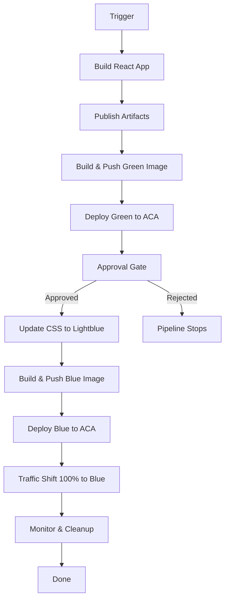

# Blue-Green Deployment Plan: React App on Azure Container Apps

## Overview

This plan outlines a blue-green deployment strategy for the React DevOps application using Azure Container Apps and Azure DevOps pipelines. The approach minimizes downtime by running two identical production environments (green and blue), with traffic controlled by ACA revision management and approval gates for safe production updates.

## Architecture

```
┌─────────────────────────────────────┐
│     Azure Container Apps            │
│   (Single app, multiple revisions)  │
├─────────────────────────────────────┤
│  Green Revision (lightgreen)         │
│  └─ 100% traffic initially           │
│                                      │
│  Blue Revision (lightblue)           │
│  └─ 0% traffic (after approval)      │
│  └─ 100% traffic (after traffic swap)│
└─────────────────────────────────────┘
```

## Pipeline Stages

### Stage 1: Build React App

- **Trigger**: Manual or on commit (configurable)
- **Tasks**:
  - Install Node.js 22.x
  - Install dependencies (`npm ci`)
  - Run linter (`npm run lint`)
  - Build React app (`npm run build`)
  - Publish build artifacts
  - Build Docker image with `green` tag
  - Push to ACR (az400acrdev)

### Stage 2: Deploy Green Environment

- **Display Name**: "Deploy to ACA - Green"
- **Tasks**:
  - Deploy container app with revision labeled `green`
  - Route 100% of traffic to green revision
  - Verify health endpoint
  - Document green deployment details

### Stage 3: Approval Gate

- **Environment**: `aca-blue-green-approval`
- **Approval Requirements**:
  - Manual approval from designated team member
  - Optional approval notes for audit trail
- **Success Criteria**:
  - Green environment has been validated
  - Team is ready to proceed with blue deployment
  - CSS changes (lightgreen → lightblue) prepared for next stage

### Stage 4: Update Configuration & Deploy Blue

- **Trigger**: After approval
- **Pre-deployment**:
  - Update `src/react/react-devops/src/App.css`: change `background-color: lightgreen` to `background-color: lightblue`
  - Commit CSS change to `blue-deployment` branch
- **Deployment Tasks**:
  - Build Docker image with `blue` tag (includes CSS update)
  - Push to ACR
  - Deploy container app with revision labeled `blue`
  - Initial traffic: 0% to blue, 100% to green

### Stage 5: Traffic Switch (Optional Canary)

- **Manual or Automated**:
  - Gradually shift traffic: 10% → 25% → 50% → 100% to blue (if using canary)
  - Or immediately switch 100% traffic to blue revision
  - Document traffic shift timeline
  - Monitor error rates and latency during transition

### Stage 6: Cleanup (Optional)

- **Tasks**:
  - Remove or deactivate green revision after blue is stable
  - Archive deployment logs
  - Update deployment documentation

## Key Configuration Values

From `.github/deploy.json`:

| Parameter                | Value                                      |
| ------------------------ | ------------------------------------------ |
| Service Connection       | `wi-az400-dev`                             |
| Azure Container Registry | `az400acrdev`                              |
| ACA Environment          | `az400acaenv`                              |
| Resource Group           | `az400-dev`                                |
| ADO Org                  | `https://dev.azure.com/integrationsonline` |
| ADO Project              | `az-400`                                   |

## Application Details

- **Source Path**: `src/react/react-devops/`
- **CSS File**: `src/react/react-devops/src/App.css`
- **Container Port**: `5173` (Vite dev server) or `3000` (Node server)
- **Build Output**: `dist/` directory
- **Node Version**: `22.x`

## CSS Changes

### Green Deployment

```css
.app {
  background-color: lightgreen;  /* Original */
}
```

### Blue Deployment

```css
.app {
  background-color: lightblue;  /* Updated after approval */
}
```

## Approval Environment

**Environment Name**: `aca-blue-green-approval`

- **Approvers**: DevOps team, Release manager, or product owner
- **Timeout**: 7 days (default)
- **Approval Notes**: Optional; captures why approval was granted/denied

## Implementation Notes

1. **Image Tagging**: Images are tagged with `green` and `blue` for easy identification in ACR
2. **Revision Management**: ACA automatically creates new revisions; labels help identify which version is which
3. **Rollback Strategy**: Keep green revision active until blue is verified stable; simple traffic swap returns to green if needed
4. **Monitoring**: Use Azure Monitor and Application Insights for health checks during traffic shift
5. **Secrets**: ACR credentials fetched dynamically using AzureCLI task with service connection

## Pipeline Execution Flow



## Next Steps

1. Create Azure DevOps environment `aca-blue-green-approval` in the az-400 project
2. Configure approvers for the environment
3. Create and run `.azdo/blue-green.yaml` pipeline
4. Validate green deployment
5. Approve blue deployment
6. Validate blue deployment and traffic shift
7. Optional: Clean up green revision and iterate for next release

## References

- [Azure Container Apps Revisions and Traffic Control](https://learn.microsoft.com/en-us/azure/container-apps/revisions)
- [Azure DevOps Environments and Approvals](https://learn.microsoft.com/en-us/azure/devops/pipelines/process/environments)
- [Blue-Green Deployment Pattern](https://learn.microsoft.com/en-us/azure/architecture/patterns/blue-green-deployment)
