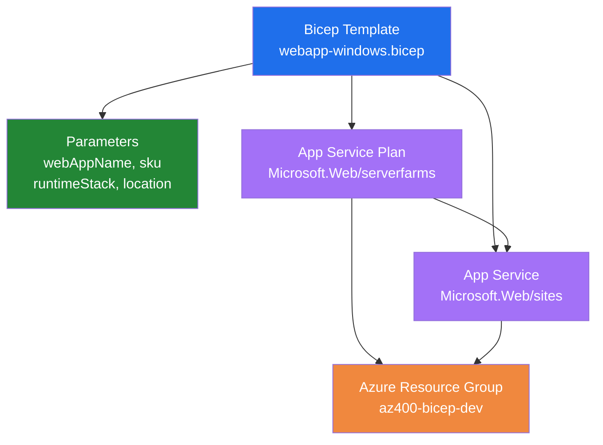

# Infrastructure as Code with Bicep and Azure CLI

Bicep is a domain-specific language (DSL) that simplifies authoring Azure Resource Manager (ARM) templates. Bicep templates are declarative, human-readable, and compile to ARM JSON templates automatically. Combined with Azure CLI, Bicep enables reproducible infrastructure deployments with clear syntax and strong typing.

## What It Demonstrates

This demo shows three key Bicep workflows: deploying infrastructure from Bicep templates, validating deployments before execution, and reverse-engineering existing resources into Bicep code. You'll create a web application using a Bicep template, preview changes before deploying, export an existing resource group, and decompile it back to Bicep format.

## Deployment from Bicep

The [create-webapp-windows.azcli](create-webapp-windows.azcli) script demonstrates safe, validated deployment:

```azcli
env=dev
grp=az400-bicep-$env
loc=westeurope
bicep=webapp-windows.bicep
app=bicep-site-$env

# Create resource group
az group create -n $grp --location $loc

# Preview changes before deployment (what-if)
az deployment group what-if --resource-group $grp \
   --template-file $bicep \
   --parameters webAppName=$app

# Deploy the infrastructure
az deployment group create --resource-group $grp \
    --template-file $bicep \
    --parameters webAppName=$app
```

**Key pattern:** The `what-if` command previews all infrastructure changes without applying them—letting you review changes before committing. This prevents unexpected modifications to production environments.

## Bicep Template Structure

The [webapp-windows.bicep](webapp-windows.bicep) template shows Bicep fundamentals:



```bicep
param webAppName string = 'webapp-bicep'          // Web app name
param sku string = 'B1'                            // The SKU of App Service Plan
param runtimeStack string = 'DOTNET|8.0'          // The runtime stack
param location string = resourceGroup().location  // Location for all resources

var appServicePlanName = toLower('appService-${webAppName}')

resource appServicePlan 'Microsoft.Web/serverfarms@2023-12-01' = {
  name: appServicePlanName
  location: location
  sku: {
    name: sku
  }
  kind: 'linux'
  properties: {
    reserved: true
  }
}

resource appService 'Microsoft.Web/sites@2023-12-01' = {
  name: webAppName
  location: location
  kind: 'app'
  properties: {
    serverFarmId: appServicePlan.id
    siteConfig: {
      linuxFxVersion: runtimeStack
    }
  }
}
```

**Notable features:**

- **Parameters** — Accept webAppName, SKU, runtime stack, and location as inputs for flexible reuse
- **Variables** — Compute derived values (e.g., lowercase naming) using expressions
- **Symbolic references** — Use `appServicePlan.id` to reference resource IDs without string manipulation
- **Strong typing** — Parameters declare types (string) with validation built-in

## Reverse Engineering: Export to Bicep

The [export-bicep.azcli](export-bicep.azcli) script extracts existing resources and converts them to Bicep:

```azcli
grp=az400-m06-bicep
file=ressource.json

# Export resource group to ARM template JSON
az group export -n $grp > $file

# Decompile ARM JSON to readable Bicep
az bicep decompile --file ./$file
```

This workflow is useful for converting manually-created resources into version-controlled infrastructure code. The exported JSON is automatically decompiled into human-readable Bicep format.

## Complex Multi-Container Deployment

The [create-container-app.azcli](create-container-app.azcli) and [main.bicep](main.bicep) demonstrate enterprise patterns with multiple parameters and ACR integration:

```azcli
az deployment group create -f main.bicep -g $grp \
    -p appName=food-app-$env \
    -p acaEnvName=$acaenv \
    -p acrName=$acr \
    -p acrPwd=$acrPwd \
    -p catalogName='catalog-service' \
    -p catalogImage='catalog-service' \
    -p shopName='food-shop' \
    -p shopImage='food-shop' \
    -p orderName='order-service' \
    -p orderImage='order-service'
```

This approach parameterizes container images, registry credentials, and service names, enabling deployment of microservices across environments with a single template and different parameters.

## Key Benefits

**Readability** — Bicep syntax is clear and concise compared to ARM JSON templates, making infrastructure easier to understand and maintain.

**Type Safety** — Parameters and variables have declared types with validation, catching errors before deployment.

**Modularity** — Bicep supports references and symbolic resource names, eliminating string-based coupling between resources.

**What-If Validation** — Preview changes before applying them, ensuring no surprises in production.

**Reverse Engineering** — Convert existing manually-created resources back to code for governance and version control.

## Tools & Resources

[Bicep Documentation](https://learn.microsoft.com/en-us/azure/azure-resource-manager/bicep/) — Language reference, examples, and best practices.

[Bicep Playground](https://aka.ms/bicepdemo) — Interactive environment to write and preview Bicep templates without local setup.

[Bicep VS Code Extension](https://marketplace.visualstudio.com/items?itemName=ms-azuretools.vscode-bicep) — Syntax highlighting, intellisense, and validation for Bicep files.

[ARM Template Best Practices](https://learn.microsoft.com/en-us/azure/azure-resource-manager/templates/best-practices) — Patterns for reliable, maintainable infrastructure templates.
