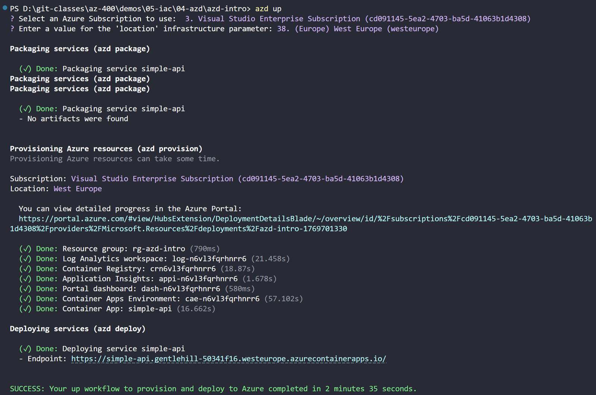

# Azure Developer CLI Getting started

## Prerequisites

Install Azure Developer CLI and Bicep CLI:

```bash
Winget install --id Microsoft.Azure.DeveloperCLI -e
winget install --id Microsoft.Bicep -e
```

## Initialize your project

This command sets up your project with the necessary configuration files and prepares your environment for development with Azure services.
It detects the type of application in your current directory and initializes it for deployment to Azure and stores the configuration in an `azure.yaml` file:

```bash
azd init
```

## Create the Bicep for your infrastructure

Next we will automatically generate the Bicep files that define the infrastructure for your application in the infra folder:

```bash
azd infra gen
```

## Deploy your application

Now you can deploy your application to Azure using the following command:

```bash
azd up
```

Select your Azure subscription and the region to deploy to when prompted:



> Note: After checking your deployment, examine the .azure folder to see the generated configuration files.
