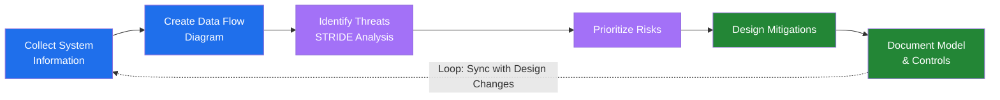

# Threat Modeling

Threat modeling is a systematic security analysis approach that identifies vulnerabilities and attack vectors during the design phase—when fixes are most cost-effective. Using the **STRIDE methodology** (Spoofing, Tampering, Repudiation, Information Disclosure, Denial of Service, Elevation of Privilege), teams create data flow diagrams to map system components, trust boundaries, and external dependencies, then analyze potential threats and design appropriate mitigations before development begins.

## Why Threat Modeling Matters

Threat modeling delivers significant cost and security benefits. Early design-phase fixes cost orders of magnitude less than production remediation—NIST estimates **40x lower cost** than fixing vulnerabilities in production. By embedding threat models directly into DevOps workflows and work item tracking systems, security becomes a collaborative concern where monitoring, incident response, and compliance controls are designed in advance rather than improvised during a breach. Teams gain a comprehensive security posture, validate implementations against threat analysis, and maintain consistency as systems evolve.

## Tools & Learning

[Microsoft Threat Modeling Tool](https://www.microsoft.com/en-us/securityengineering/sdl/threatmodeling) — Core element of the Microsoft SDL that enables architects to identify and mitigate security issues early using STRIDE-per-Element guided analysis and integrated reporting.

[Azure Threat Modeling](https://docs.microsoft.com/en-us/azure/security/develop/threat-modeling-tool-getting-started) — Getting started guide for applying threat modeling in Azure environments.

[Integrating Threat Modeling with DevOps](https://learn.microsoft.com/en-us/security/engineering/threat-modeling-with-dev-ops) — Best practices for embedding threat modeling into CI/CD pipelines and development workflows.

## Labs & Resources

[Threat Modeling Security Fundamentals](https://learn.microsoft.com/en-us/training/paths/tm-threat-modeling-fundamentals/) — Structured learning path covering the complete threat modeling process.
