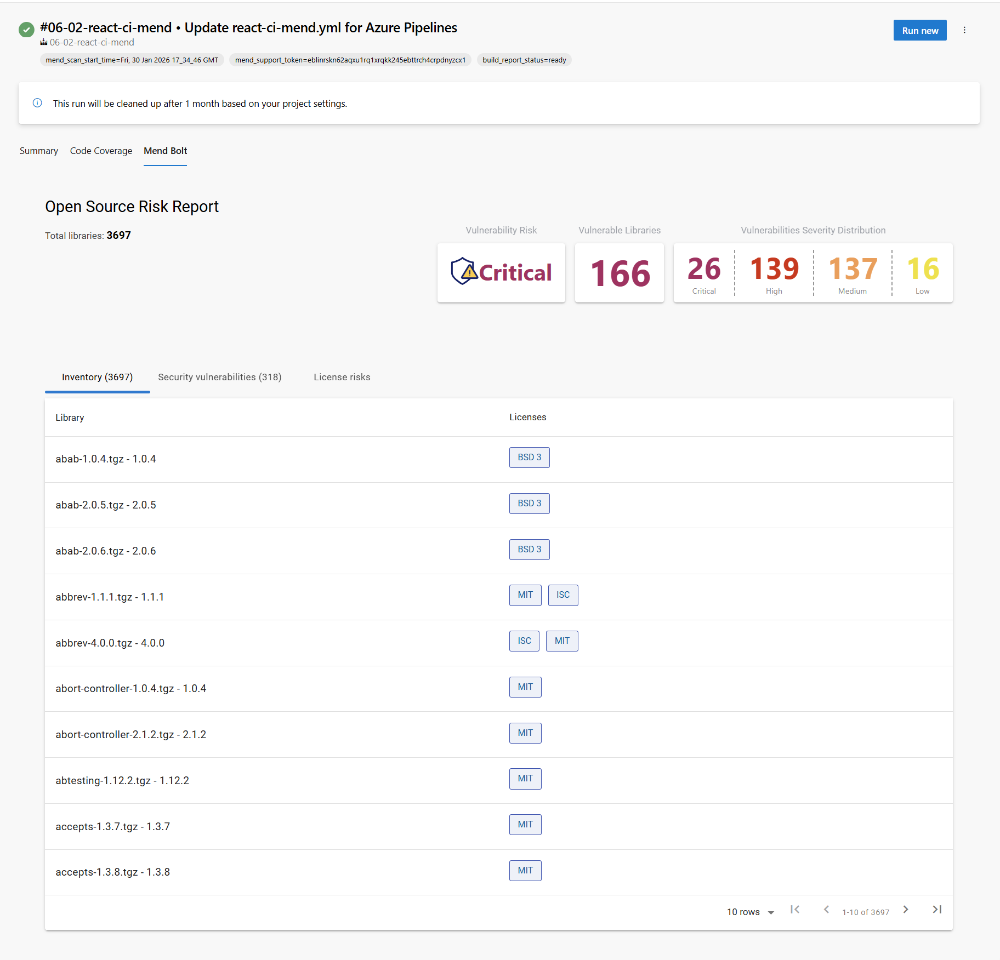
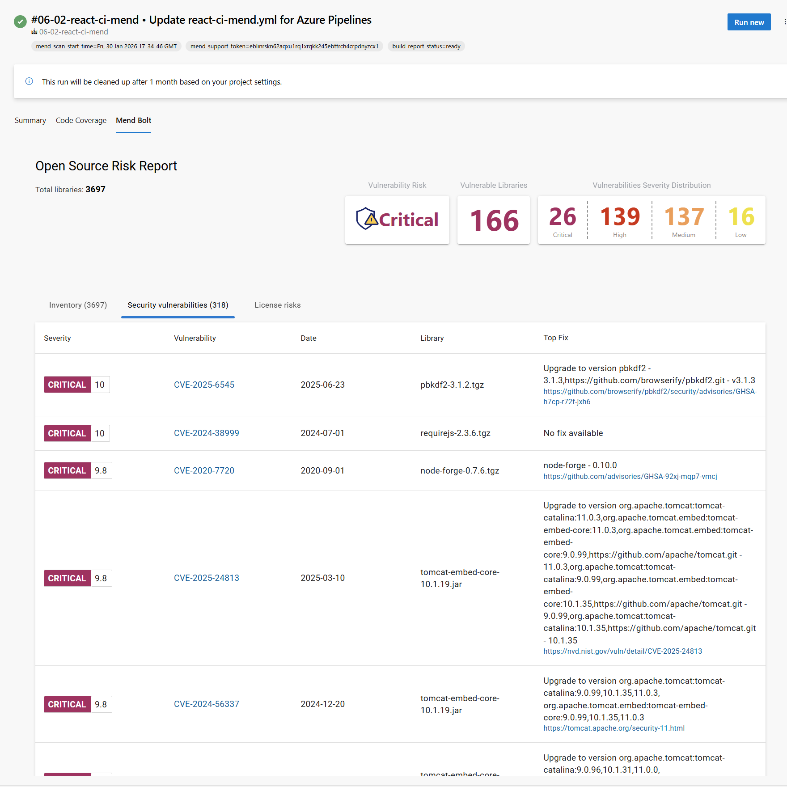
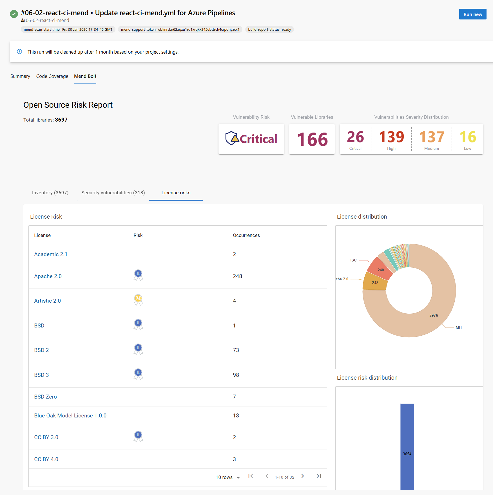

# Software Composition Analysis

Software Composition Analysis (SCA) identifies security vulnerabilities, license compliance risks, and component inventory across open-source and third-party dependencies. Organizations need SCA to understand their supply chain risk, ensure license compliance, and maintain visibility into the libraries powering their applications.

## What It Demonstrates

This demo walks through implementing comprehensive dependency scanning using **Mend Bolt**, a free SCA tool that integrates directly into Azure DevOps pipelines. You'll configure Mend in your organization, run automated scans against a React application, and interpret the results across three critical areas: dependency inventory, security vulnerabilities, and open-source license compliance.

## Setup & Execution

### 1. Install Mend Bolt

Visit the [Mend Bolt - Free Version](https://marketplace.visualstudio.com/items?itemName=whitesource.whiteSource-bolt-v2) extension in the Azure DevOps marketplace and install it in your organization.

### 2. Configure Mend

Navigate to **Organization Settings → Extensions → Mend Bolt → Configure** to authorize the extension with your Mend account.

### 3. Run the Pipeline

Execute the [react-ci-mend.yml](/.azdo/react-ci-mend.yml) pipeline to scan your React application's dependencies. The pipeline automatically detects all direct and transitive dependencies and generates comprehensive SCA reports.

## Scan Results

Mend Bolt provides visibility across three key dimensions:

**Dependency Inventory** — Complete bill of materials showing all dependencies, their versions, and transitive relationships. This inventory serves as the source of truth for your application's supply chain.

**Security Vulnerabilities** — Identified CVEs in your dependencies mapped to severity levels (Critical, High, Medium, Low). Each vulnerability includes affected versions and recommended remediation paths. Mend continuously updates its database against the latest security disclosures.

**License Compliance** — Categorization of open-source licenses by risk (Permissive, Weak Copyleft, Strong Copyleft, Proprietary). Organizations can enforce license policies to prevent GPL, AGPL, or other restricted-license dependencies from entering production.

## Tools & References

[Open Source Licenses](https://opensource.org/licenses) — License database and governance models.

[OWASP Dependency Check](https://marketplace.visualstudio.com/items?itemName=dependency-check.dependencycheck) — Community-driven SCA tool for Azure DevOps.

[WhiteSource Advice](https://marketplace.visualstudio.com/items?itemName=whitesource.whitesource-advise) — Legacy VS Code extension for local dependency scanning.
