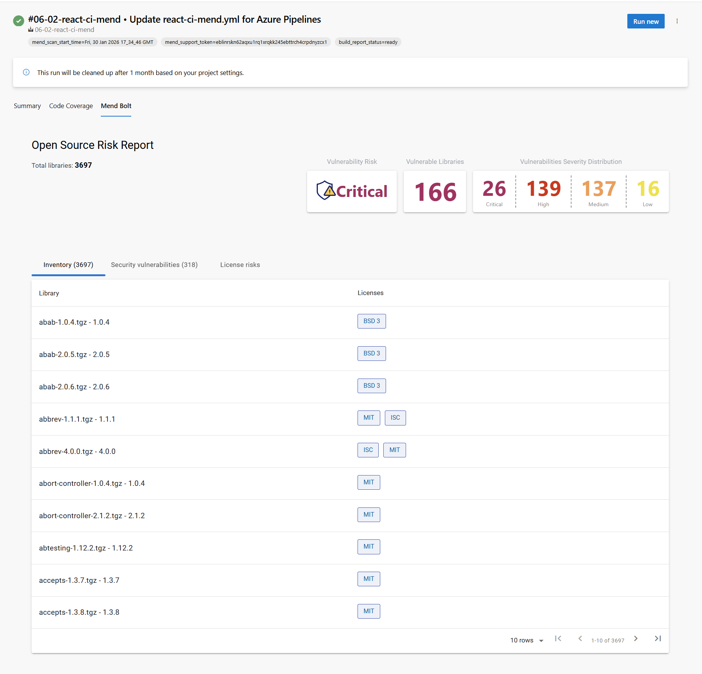
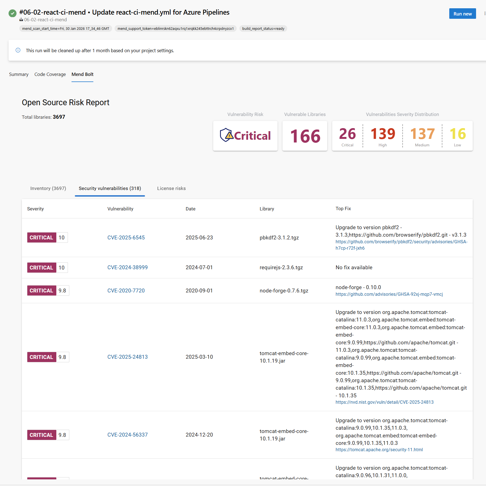
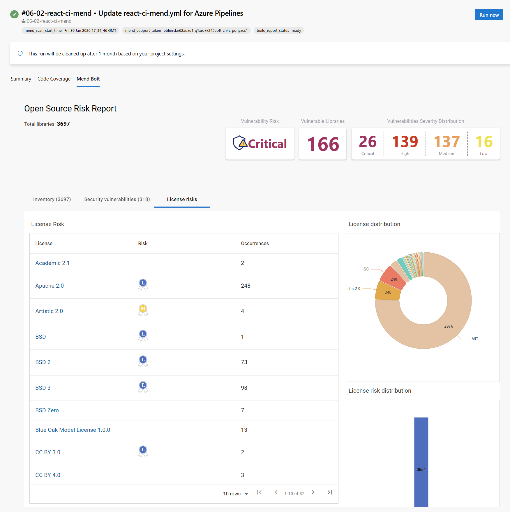

# Software Composition Analysis

[Open Source Licenses](https://opensource.org/licenses)

[OWASP Dependency Check](https://marketplace.visualstudio.com/items?itemName=dependency-check.dependencycheck)

[WhiteSource Advice](https://marketplace.visualstudio.com/items?itemName=whitesource.whitesource-advise)

## Demos

### Mend

Install Mend Bolt Extension in Azure DevOps Organization

[Mend Bolt - Free Version](https://marketplace.visualstudio.com/items?itemName=whitesource.whiteSource-bolt-v2)

[Mend Docs](https://docs.mend.io/integrations/latest/mend-bolt-for-azure-pipelines?_gl=1*1e0grrn*_gcl_au*MTMxMzY2ODQ4NC4xNzY5NzkyOTky)

Go to Organization Settings -> Extensions -> Mend Bolt -> Configure

Run [react-ci-mend.yml](/.azdo/react-ci-mend.yml)

Mend results:

Inventory:

Vulnerabilities:

License risks:

