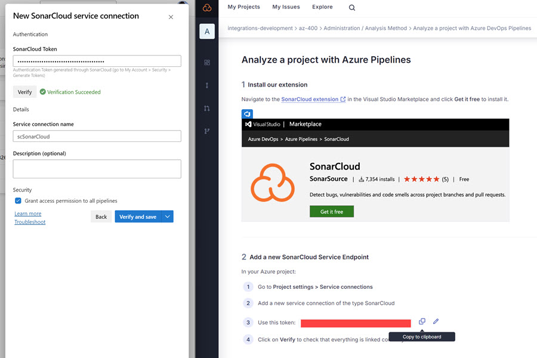
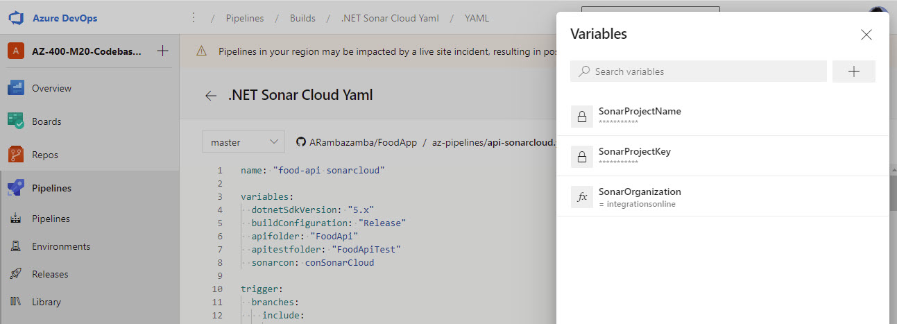

# Static Analysis using SonarCloud

Static code analysis automatically scans source code to identify bugs, security vulnerabilities, and code quality issues before they reach production. This demo uses **SonarCloud**, a cloud-native static analysis platform that integrates into Azure DevOps pipelines to provide continuous code quality insights across your development lifecycle.

## What It Demonstrates

Automated code quality gates in CI/CD pipelines using SonarCloud analysis. The pipeline scans a .NET Catalog API service for code smells, bugs, security hotspots, and coverage metrics, then reports results back to the pull request. This enables developers to catch issues early and maintain code quality standards without manual review bottlenecks.

## Setup & Execution

### 1. Register SonarCloud Organization & Project

Create a free account at [SonarCloud](https://sonarcloud.io) and set up a new organization and project. SonarCloud will assign a unique project key used to identify your code during analysis.

### 2. Create Authentication Token

Generate a user token in SonarCloud for authentication:

Store this token securely as an Azure DevOps service connection variable (`scSonarCloud`).

### 3. Configure Pipeline Variables

Set up the required variables in your Azure DevOps pipeline or variable group:

Key variables for [catalog-ci-sonar-cloud.yml](/.azdo/catalog-ci-sonar-cloud.yml):

- `sonarCon` — Service connection name (e.g., `scSonarCloud`)
- `sonaOrg` — SonarCloud organization key
- `sonarKey` — SonarCloud project key
- `sonarProj` — Display name for the project

### 4. Run the Pipeline

Execute [catalog-ci-sonar-cloud.yml](/.azdo/catalog-ci-sonar-cloud.yml) to trigger analysis. The pipeline:

1. Restores NuGet dependencies
2. Prepares SonarCloud scanner configuration
3. Builds the .NET project in Release mode
4. Runs static analysis and code coverage
5. Publishes results to SonarCloud

### 5. Review Analysis Results

View comprehensive analysis in [SonarCloud Dashboard](https://sonarcloud.io/summary/new_code?id=integrations-development_az-400&branch=main). Metrics include:

- **Code Coverage** — Test coverage percentage and untested code paths
- **Security Hotspots** — Potential security vulnerabilities requiring review
- **Code Smells** — Maintainability issues and technical debt
- **Reliability Issues** — Potential bugs based on patterns and logic

## Tools & Resources

[SonarLint VS Code Extension](https://marketplace.visualstudio.com/items?itemName=SonarSource.sonarlint-vscode) — Real-time code analysis in your editor as you write code.

[Defender for DevOps](https://learn.microsoft.com/en-us/azure/defender-for-cloud/defender-for-devops-introduction) — Microsoft's cloud-native security posture management integrating with Azure Pipelines and GitHub Actions.

[Defender for Containers](https://learn.microsoft.com/en-us/azure/defender-for-cloud/defender-for-containers-introduction) — Container image scanning and runtime threat protection.
