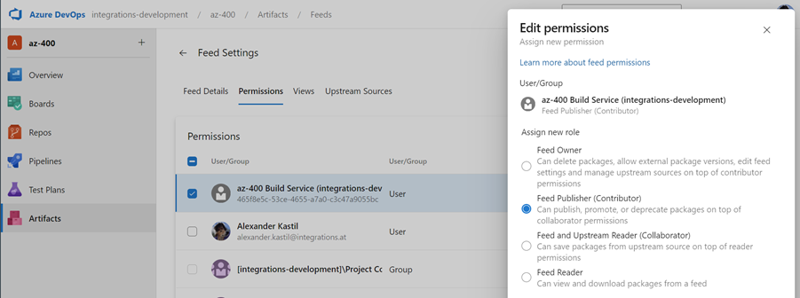
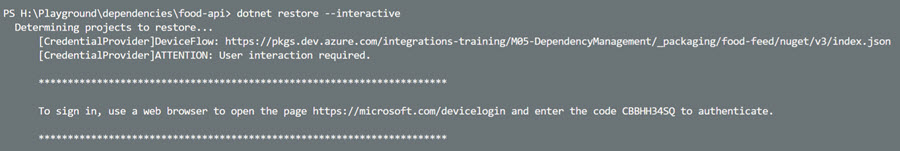

# Azure Artifacts

## Artifacts General

Azure Artifacts provides a centralized package management feed for NuGet, npm, Maven, and Python packages within Azure DevOps. This enables teams to share internal packages across projects while maintaining secure, scalable dependency management.

## food-app-common Package

[food-app-common-ci-cd-artifacts.yml](/.azdo/food-app-common-ci-cd-artifacts.yml) demonstrates creating and publishing a shared library package. The pipeline restores dependencies, builds the .NET library, runs unit tests, and publishes a semantically versioned NuGet package to the Azure Artifacts feed. Automation ensures consistent versioning using build IDs and gates publication to the main branch only.

**Setup:** Create a feed named `food-packages` in Azure Artifacts and assign permissions to the [PROJECT]\Build Service.



### Using Packages: Simple Build

[orders-ci.yml](/.azdo/orders-ci.yml) shows consuming the published NuGet package from Azure Artifacts. Instead of referencing the local project, the pipeline restores dependencies from the feed using package references and authenticates via NuGetAuthenticate task.

Replace the local project reference in [order-service.csproj](/src/services/order-service/order-service.csproj):

```xml
<ItemGroup>
    <PackageReference Include="MediatR" Version="12.5.0" />
    <PackageReference Include="Microsoft.ApplicationInsights.AspNetCore" Version="2.23.0" />
    <PackageReference Include="Microsoft.Azure.Cosmos" Version="3.51.0" />
    <PackageReference Include="Swashbuckle.AspNetCore" Version="10.1.0" />
    <PackageReference Include="Swashbuckle.AspNetCore.Annotations" Version="10.1.0" />
    <PackageReference Include="System.Linq" Version="4.3.0" />
    <PackageReference Include="food-app-common" Version="10.0.0" />
</ItemGroup>
```

Configure [nuget.config](/src/services/order-service/nuget.config) to point to the private feed:

```xml
<?xml version="1.0" encoding="utf-8"?>
<configuration>
  <packageSources>
    <clear />
    <add key="food-packages" value="https://pkgs.dev.azure.com/integrationsonline/az-400/_packaging/food-packages/nuget/v3/index.json" />
  </packageSources>
</configuration>
```

Use the [Azure Artifacts Credential Provider](https://github.com/microsoft/artifacts-credprovider) for local development with device auth flow:



### Using Packages with Containers

The [food-shop-ci-docker-img.yml](/.azdo/food-shop-ci-docker-img.yml) pipeline demonstrates building containerized applications using the [t-build-docker-image.yaml](/.azdo/templates/t-build-docker-image.yaml) template. This template handles Docker image authentication and registry push operations.

For .NET services that consume internal packages, the dockerfile must handle Azure Artifacts authentication during the build stage. The [order-service dockerfile](/src/services/order-service/dockerfile) demonstrates this pattern:

**Build Stage - Install Credential Provider and Restore Dependencies:**

```dockerfile
FROM mcr.microsoft.com/dotnet/sdk:10.0 AS build
WORKDIR /build
COPY . .

# Install Credential Provider and set env variables to enable Nuget restore with auth
ARG PAT
ARG FEED_URL=https://pkgs.dev.azure.com/integrationsonline/az-400/_packaging/food-packages/nuget/v3/index.json
RUN wget -qO- https://raw.githubusercontent.com/Microsoft/artifacts-credprovider/master/helpers/installcredprovider.sh | bash
ENV NUGET_CREDENTIALPROVIDER_SESSIONTOKENCACHE_ENABLED=true
ENV VSS_NUGET_EXTERNAL_FEED_ENDPOINTS="{\"endpointCredentials\": [{\"endpoint\":\"${FEED_URL}\", \"username\":\"docker\", \"password\":\"${PAT}\"}]}"
ENV DOTNET_SYSTEM_NET_HTTP_USESOCKETSHTTPHANDLER=0

RUN dotnet restore "order-service.csproj"
RUN dotnet publish -c Release -o /app
```

**Runtime Stage - Slim image for production:**

```dockerfile
FROM mcr.microsoft.com/dotnet/aspnet:10.0 AS final
WORKDIR /app
COPY --from=build /app .
ENTRYPOINT ["dotnet", "order-service.dll"]
```

**Key Patterns:**

- **PAT as Build Argument:** Pass the Personal Access Token securely as a `--build-arg` instead of hardcoding it
- **Multi-stage Build:** Separates the large SDK image (build) from the smaller runtime image (final), reducing production image size
- **Credential Provider Installation:** Automatically installs the Azure Artifacts credential provider and configures environment variables for NuGet authentication
- **Feed Configuration:** Uses the same `nuget.config` for both local and containerized builds, ensuring consistency

**Build Command:**

```bash
docker build --rm -f dockerfile -t order-service . --build-arg PAT=<YOUR_PAT_TOKEN>
```

This containerized approach ensures that sealed, reproducible images can access internal dependencies without exposing credentials, maintaining security across development and production environments.

## Links & Resources

[Artifacts in Azure Pipelines](https://docs.microsoft.com/en-us/azure/devops/pipelines/artifacts/artifacts-overview?view=azure-devops&tabs=nuget)

[Azure Artifacts Credential Provider](https://github.com/microsoft/artifacts-credprovider#azure-artifacts-credential-provider)

[Azure Artifacts Upstream Sources](https://docs.microsoft.com/en-us/azure/devops/artifacts/concepts/upstream-sources?view=azure-devops)
