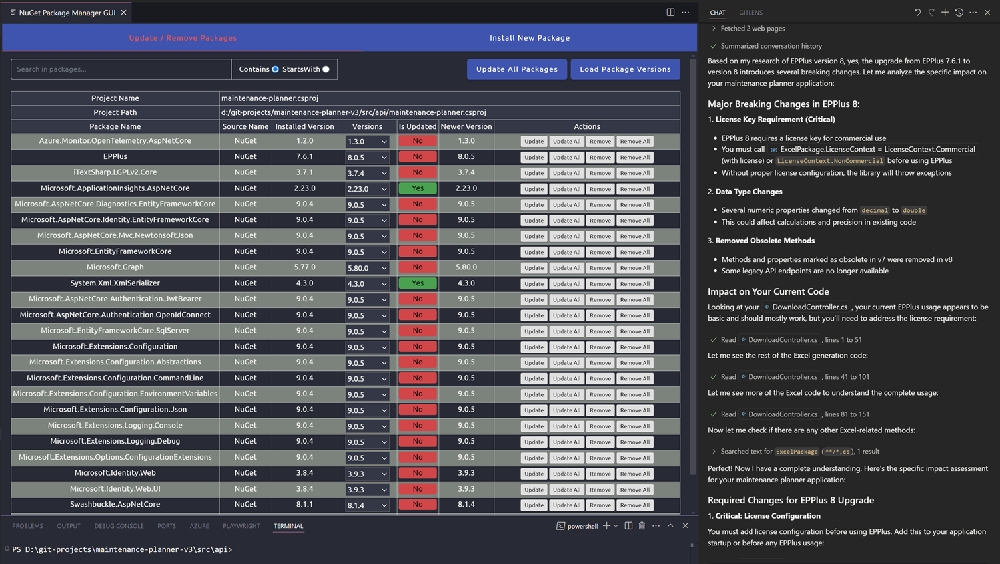

# Agentic DevOps

[Agentic DevOps](https://azure.microsoft.com/en-us/blog/agentic-devops-evolving-software-development-with-github-copilot-and-microsoft-azure/) is a set of tools and techniques to help you manage your DevOps tasks using AI.

## Write Docs using reusable prompts

Use a re-usable prompt `create-docs.prompt.md` to write documentation for your project:

## Write Unit Tests

AI can help you write unit tests for your code.

## Use MCPs to complete tasks

- Explain registration of MCP Servers using mcp.json

[Model Control Protocol (MCP)](https://modelcontextprotocol.io/introduction)

[MCP Servers](https://github.com/modelcontextprotocol/servers) are used to provide a context for AI models to work with. They can be registered in the `mcp.json` file in the root of your project.

[Smithery](https://smithery.ai/)

### GitHub MCP

- list all my repos
- what was the latest pull request on REPO_NAME

### Mermaid MCP

- create a Mermaid diagram of the src directory

> Note: A [log](mermaid-log.md) of the Mermaid MCP is available.

## Advise on Upgrades

As about breaking changes in your dependencies and how to upgrade them.

