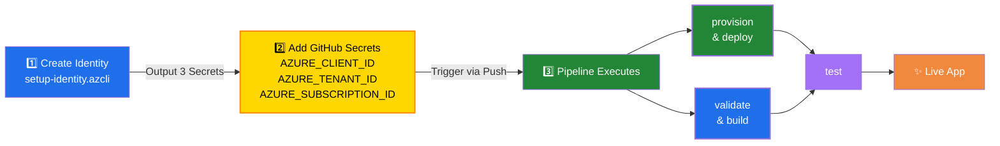

# React Static Web App Deployment with GitHub Actions

Automated CI/CD for a [React app](/src/react/react-devops/) deployed to Azure Static Web Apps using workload identity federation. Three-step process: create identity → configure GitHub secrets → let the pipeline handle everything.



## Setup

### Step 1: Create Identity

Run [setup-identity.azcli](setup-identity.azcli) once to create the managed identity and federated credentials:

```bash
./setup-identity.azcli
```

This creates a resource group, managed identity, and OIDC credentials for GitHub Actions.

### Step 2: Add GitHub Secrets

Copy the three secrets output from the script to your GitHub repository:

Settings → Secrets and variables → Actions

- `AZURE_CLIENT_ID`
- `AZURE_TENANT_ID`
- `AZURE_SUBSCRIPTION_ID`

### Step 3: Pipeline Runs Automatically

The [react-static-webapp-deploy.yml](../.github/workflows/react-static-webapp-deploy.yml) workflow handles:

- **provision** → Creates resource group and Static Web App
- **validate & build** → Lint and compile React app (parallel execution)
- **test** → E2E tests with Playwright
- **deploy** → Upload artifacts to Azure and verify

## Links & Resources

[Azure Static Web Apps](https://learn.microsoft.com/en-us/azure/static-web-apps/)

[az staticwebapp](https://learn.microsoft.com/en-us/cli/azure/staticwebapp?view=azure-cli-latest)
