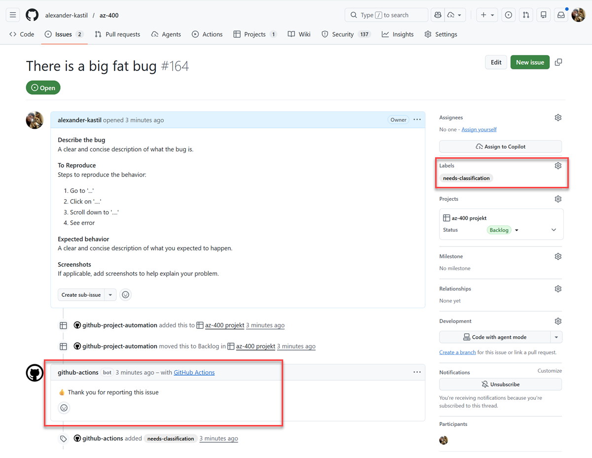

# Using GitHub Script

Demonstrates using the GitHub Script action to interact with GitHub APIs directly from workflows. GitHub Script simplifies working with the Octokit REST API by providing direct access to the GitHub context within a workflow, enabling programmatic repository management without additional authentication.


_Automated issue processing with concurrent comment and label operations_

## Example: Automated Issue Processing

The workflow shows how to automatically respond to new issues with both comments and labels, demonstrating concurrent job execution for efficient repository automation.

**What it demonstrates:**

- **Event-driven automation** - Triggers on issue creation to process incoming reports immediately
- **Concurrent API operations** - Executes comment and label operations in parallel for improved efficiency
- **Octokit REST API integration** - Programmatically manages issues using the GitHub API directly within the workflow

```yaml
name: process issues - github script sample

on:
  issues:
    types: [opened]

jobs:
  comment:
    runs-on: ubuntu-latest
    steps:
      - uses: actions/github-script@v4
        with:
          script: |
            github.issues.createComment({
              issue_number: context.issue.number,
              owner: context.repo.owner,
              repo: context.repo.repo,
              body: ":thumbsup: Thank you for reporting this issue"
            })

  apply-label:
    runs-on: ubuntu-latest
    steps:
      - uses: actions/github-script@v4
        with:
          script: |
            github.issues.addLabels({
              issue_number: context.issue.number,
              owner: context.repo.owner,
              repo: context.repo.repo,
              labels: ['needs-classification']
            })
```

**Key technical details:**

- Uses Octokit's `github.issues` API to interact with repository issues
- Access to `context.issue` provides automatic issue metadata from the triggering event
- Parallel jobs eliminate sequential processing overhead for independent operations

## Links & Resources

[GitHub Script](https://github.com/actions/github-script)

[octokit/rest.js](https://octokit.github.io/rest.js/v18)

[GitHub Emoji Cheat Sheet](https://github.com/ikatyang/emoji-cheat-sheet/blob/master/README.md)
