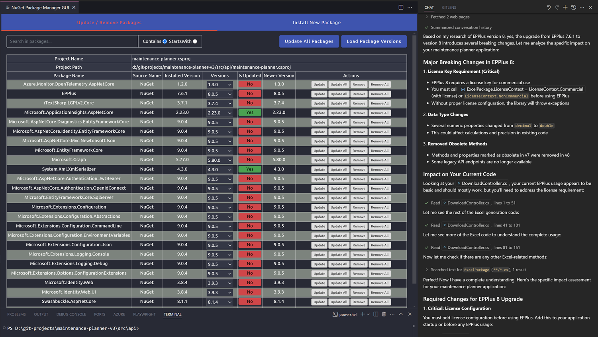

# Agentic DevOps

[Agentic DevOps](https://azure.microsoft.com/en-us/blog/agentic-devops-evolving-software-development-with-github-copilot-and-microsoft-azure/) is a set of tools and techniques to help you manage your DevOps tasks using AI.

## Write Docs using reusable prompts

Use a re-usable prompt `create-docs.prompt.md` to write documentation for your project:

## Write Unit Tests

AI can help you write unit tests for your code.

## Use MCPs to complete tasks

- Explain registration of MCP Servers using mcp.json

[Model Control Protocol (MCP)](https://modelcontextprotocol.io/introduction)

[MCP Servers](https://github.com/modelcontextprotocol/servers) are used to provide a context for AI models to work with. They can be registered in the `mcp.json` file in the root of your project.

[Smithery](https://smithery.ai/)

### GitHub MCP

- list all my repos
- what was the latest pull request on REPO_NAME

### Mermaid MCP

- create a Mermaid diagram of the src directory

> Note: A [log](mermaid-log.md) of the Mermaid MCP is available.

## Advise on Upgrades

As about breaking changes in your dependencies and how to upgrade them.



## Copilot Agent & Skills

### Azure DevOps Agent

The **AzDevOps** agent provides specialized Azure DevOps pipeline expertise. It writes YAML pipelines following Microsoft Learn best practices, imports pipelines to Azure DevOps, runs them, troubleshoots failures, and manages service connections. The agent automatically retrieves configuration (org, project, service connections) from Copilot memory, saving setup time. Use it for: creating new pipelines, diagnosing pipeline failures, managing workload identity service connections, and importing complex multi-stage pipelines.

### Copilot Skills

**import-pipeline**: Automates the import of pipeline YAML files to Azure DevOps using deployment metadata from `.github/deploy.json`. It handles pipeline creation, execution, and error diagnosis all in one command. Example: "Import the catalog-ci-cd.yml pipeline and run it for me."

Sample `.github/deploy.json`:

```json
{
    "Azure Service Connection (ARM)": "my-service-connection",
    "Git Repo Url": "https://github.com/myusername/my-repo",
    "GitHub Service Connection ID": "xxxxxxxx-xxxx-xxxx-xxxx-xxxxxxxxxxxx",
    "ADOOrg": "https://dev.azure.com/myorgname",
    "ADOProject": "my-project",
    "AzureContainerAppsEnvironment": "my-aca-env",
    "AzureContainerRegistry": "myacrname",
    "DockerRegistry": "my-docker-registry-connection"
}
```

**get-pipeline-logs**: Retrieves logs from the latest Azure DevOps pipeline run with automatic run ID detection. Useful for troubleshooting failures when you need to see detailed task output. Example: "Get the logs from the latest catalog-ci-cd pipeline run."
