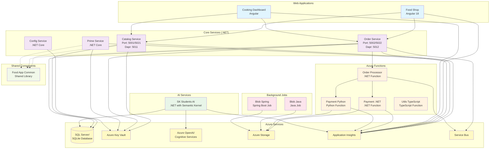

# Food App Services Architecture

## Service Details

### Web Applications

- **Food Shop**: Angular 18 customer-facing application for ordering food
- **Cooking Dashboard**: Angular dashboard for restaurant staff to manage orders

### Core Services (.NET)

- **Catalog Service**: Manages food catalog, menus, and product information
- **Order Service**: Handles order processing, CQRS pattern implementation
- **Prime Service**: Additional business logic service
- **Config Service**: Configuration management service

### Azure Functions

- **Order Processor**: .NET function for processing orders asynchronously
- **Payment .NET**: .NET-based payment processing function
- **Payment Python**: Python-based payment processing function
- **Utils TypeScript**: Utility functions written in TypeScript

### AI Services

- **SK Students AI**: .NET application using Semantic Kernel for AI capabilities

### Background Jobs

- **Blob Java**: Java-based job for blob storage operations
- **Blob Spring**: Spring Boot job for storage management

### Shared Components

- **Food App Common**: Shared library containing common models and utilities

### Technology Stack

- **Frontend**: Angular 18 with Material Design
- **Backend**: .NET Core, ASP.NET Core
- **Functions**: Azure Functions (.NET, Python, TypeScript)
- **AI**: Semantic Kernel, Azure OpenAI
- **Jobs**: Java, Spring Boot
- **Database**: SQL Server / SQLite
- **Authentication**: Azure AD, MSAL
- **Monitoring**: Application Insights
- **Infrastructure**: Docker, Azure Container Apps, Dapr
